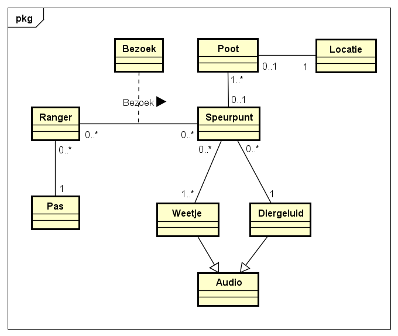

# Functioneel ontwerp

<!-- toc -->

- [domeinmodel](#domeinmodel)
- [Requirements](#requirements)
  * [Functionele Requirements](#functionele-requirements)
  * [Niet-functionele Requirements](#niet-functionele-requirements)
- [deployment](#deployment)
  * [Beide versies](#beide-versies)
  * [Development versie](#development-versie)
  * [Productie versie](#productie-versie)

<!-- tocstop -->

domeinmodel
==

Wanneer een kind voor het eerst een pas krijgt wordt de pas gekoppeld aan een nieuwe Ranger. Vanaf dat moment is het kind een ranger. Bij een ranger hoort een rangercode die het kind kan gebruiken om de volgende keer dat het kind bij burgers zoo komt verder te gaan als de zelfde ranger.

Een ranger gaat speuren naar poten. Op een saaie plek in het park staan groepjes poten waar rangers naar op zoek kunnen gaan. Een groepje van poten die dicht bij elkaar staan en allemaal het zelfde weetje afspelen heet een speurpunt.

Een ranger bezoekt dus speurpunten. De ranger kan zijn bezoeken aan de speurpunten en het moment dat het speurpunt is bezocht terugvinden in de webapplicatie.

Wanneer een ranger hun pas scant bij de poot dan spreekt de poot een weetje uit. Vervolgens laat de poot een dierengeluid horen van een dichtbijzijnd dier.

Een speurtocht staat niet in het domeinmodel omdat er geen vaste volgorde is waarin een ranger de speurpunten moet bezoeken. Vandaar dat een 'speurtocht' concept niet bestaat.

# Requirements

## Functionele Requirements
- Een ranger kan een rangerpas verkrijgen aan de kassa.
- Een ranger kan deelnemen aan een speurtocht met een rangerpas.
- Door de rangerpas te scannen aan een poot, maakt de ranger vorderingen in de speurtocht.
- De ranger kan luisteren naar een weetje en een dierengeluid door zijn rangerpas te scannen.
- De ranger kan behaalde resultaten inzien door de website te bezoeken met zijn rangercode.
- De ranger krijgt een rangercode voor thuisgebruik na afloop van zijn bezoek.
- De administrator kan poten configureren door de webinterface te gebruiken.
- De administrator kan nieuwe weetjes en geluiden toevoegen aan het systeem.
- De administrator kan weetjes en geluiden aan een poot toevoegen door de webinterface te gebruiken.
- De administrator kan een lijst van alle weetjes en geluiden zien in de webinterface.
- De administrator kan luisteren naar bestaande weetjes en geluiden in het systeem door de webinterface te gebruiken.

## Niet-functionele Requirements
- Het systeem moet meerdere requests tegelijk aankunnen.
- De poot moet in een vochtige omgeving kunnen staan.
- Het systeem moet kunnen communiceren in een omgeving zonder wifi en gps.

# deployment

Voor dit project zal er gewerkt worden met twee deployment strategieën, dit wordt gedaan omdat de deployment tijdens het testen minder secure hoeft te zijn dan tijdens echte productie. Het doel is om de productie build online te hebben bij de field-tests.

## Beide versies
Beide versies draaien op een black-box server waar [Docker](https://www.docker.com/) containers gedraaid kunnen worden (al dan niet met [docker-compose](https://docs.docker.com/compose/)). Voor zowel de development deployments als de productie deployments wordt docker gebruikt.

## Development versie

In de development deployment worden de softwareproducten gedraaid met hun built-in development servers. (bijv. npm start -> dev react app)

Dit staat ons toe om snel te schakelen tussen de verschillende producten aangezien er niks gebuild hoeft te worden.

## Productie versie

