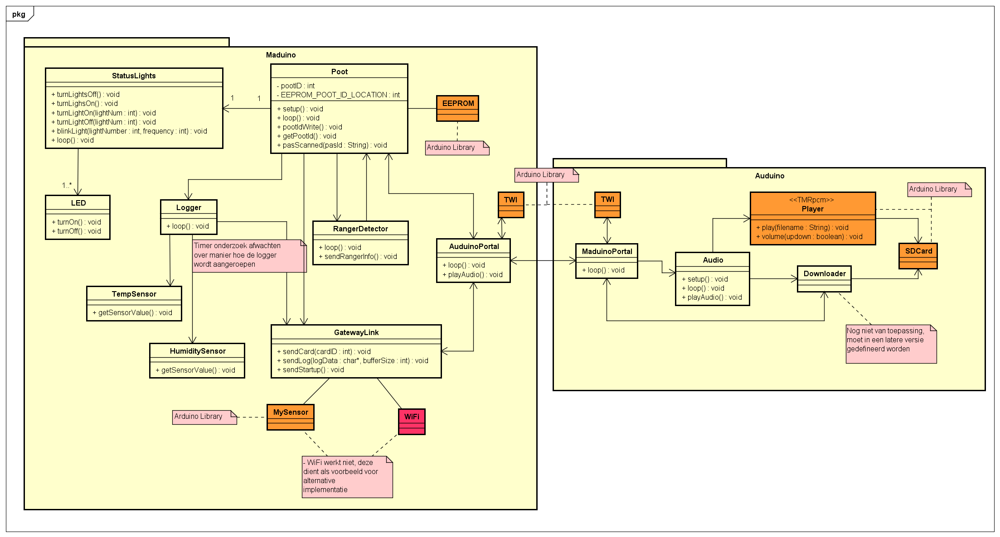

# Class Diagram IoT Poot

Zoals te zien is, is er een tweedeling van klasse in Maduino en Auduino. Dit is zoals beschreven in de [architectuur](https://github.com/HANICA-MinorMulti/nj2017-iot-dwa-BurgersZoo1/tree/master/documentatie/architectuur). Maduino is de naam voor de Master Arduino en Auduino is de naam voor de Audio Arduino.

#### AuduinoPortal & MaduinoPortal
Het 'AuduinoPortal' en 'MaduinoPortal' zorgen voor de communicatie tussen de Maduino en de Auduino. Ze werken beide op de I2C bus. Het AuduinoPortal stuurt dus berichtjes die worden ontvangen bij de MaduinoPortal. Andersom kan de MaduinoPortal berichten sturen naar de AuduinoPortal.

Deze twee portals zijn er alleen voor communicatie naar elkaar. Beide zullen bij het ontvangen van berichtjes een klasse binnen die Arduino aanroepen die dan de actie afhandelt.

Een voorbeeld: wanneer de 'RangerDetector' een ranger detecteert, wordt dit doorgegeven aan 'Poot'. Op zijn beurt zal 'Poot' op 'AuduinoPortal' de methode 'playAudio()' afroepen. Vervolgens zal 'AuduinoPortal' via de I2C bus de 'MaduinoPortal' informeren dat er audio moet worden afgespeeld. De 'MaduinoPortal' roept dan op de 'Audio' klasse 'playAudio()' aan. Zo wordt de audio afgespeeld.

#### Poot
De 'Poot' klasse is soort van de baas van het management van alle subsysteempjes die op de poot draaien. Zo zal deze klasse de globale business logica implementeren. De 'Poot' zal vanuit de ranger-detectie module te horen krijgen dat er een ranger voor de poot staat en zal de poot module de audio module en de logging module aansturen om hierop te reageren.

De 'Poot' klasse zorgt ook voor registratie en aanmelden van de poot bij de gateway en het opslaan van het pootid in EEPROM.

#### RangerDetector
Deze is verantwoordelijk voor het detecteren van welke ranger er voor de paal staat. Op dit moment wordt deze geïmplementeerd door een RFID-lezer uit te lezen en de data uit de pasjes te lezen. De 'RangerDetector' rapporteert terug naar 'Poot' zodat de 'Poot' kan besluiten wat te doen met dit event.

#### GatewayLink
Alle communicatie naar de gateway wordt gedaan door de 'GatewayLink'. Zo zal de 'Gatewaylink' methodes hebben waarmee de 'Logging' en 'RangerDetector' naar kunnen praten.

#### Logging
Deze module verzamelt informatie die te maken heeft met de uitvoering en omgeving van de poot. Bijvoorbeeld temperatuur, luchtvochtigheid, stroomverbruik en communicatie-informatie. Logging geeft de verzamelde informatie door aan de 'GatewayLink' die zorgt dat deze informatie bij de gateway aankomt.

##### TempSensor
Een klasse die een fysieke thermometer beheert. Deze thermometer wordt uitgelezen door de 'Logging'.

##### HumiditySensor
Een klasse die een fysieke luchtvochtigheidsmeter beheert. Deze luchtvochtimeter wordt uitgelezen door de 'Logging'.

#### Audio
Het afspelen en beheren van alle audiogerelateerde zaken wordt geregeld door de 'Audio' module. De audio module wordt via de 'AudionoPortal' en 'MaduinoPortal' aangestuurd via de 'Poot'. De Audio module zal de audio bestanden vanuit de 'SD-Card' lezer ophalen.

##### Player << TMRPMC &gt;&gt;
De [TMRPMC](https://github.com/TMRh20/TMRpcm/wiki) library wordt gebruikt voor het afspelen van de library. Binnen het systeem wordt dit het 'Player' component genoemd.

##### Downloader
De downloader verzorgt het ontvangen van nieuwe audio-bestanden vanuit de 'Communication' module. Dit ontvangen van audio-bestanden zal een speciaal protocol vereisen. Hiervoor zorgt de downloader.
** DE DOWNLOADER ZAL IN EEN LATER STADIUM VERDER GESPECIFICEERD WORDEN. **

#### StatusLight
Geeft door middel van een fysiek lampje feedback aan mensen die de paal onderhouden over het werk van de paal. Zo kan er een lampje zijn dat door middel van knipperen het verkeer op de communicatiekanalen aangeeft, of een lampje dat laat zien of er audio afgespeeld wordt. Het doel van de het 'StatusLight' is een visuele indicatie geven van wat er binnenin de Arduino afspeelt.

##### LED
Representeert een fysiek led lampje op een bepaalde fysieke pin op de Arduino. Kan worden aangezet of uitgezet.
