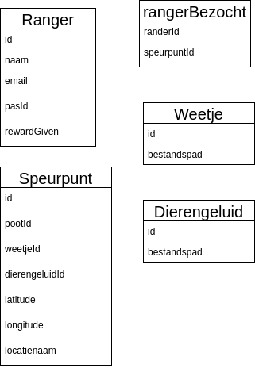

# App Datastores onderzoek
Dit onderzoek zal zich richten op de data die de applicaties van dit project op moeten gaan slaan. De opslag van hardware data wordt hierbij niet in acht genomen.
Op dit moment wordt er nagedacht om verschillende applicaties te maken voor dit project. Het kan zijn dat niet alle applicaties uiteindelijk gerealiseerd gaan worden.
Er is een administratie applicatie die het mogelijk maakt om verschillende scanpunten aan te maken en te configureren. Tevens is er een administratieve applicatie die inzichten geeft in statussen van de scanpunten voor monitoring en beheer. Er is een webapplicatie die door bezoekers na hun bezoek gebruikt kan worden om de ervaringen in het park te herbeleven. Dit onderzoek gaat kijken wat er het beste als datastore gebruikt kan worden voor deze applicaties.

## Onderzoeksmethode
Dit onderzoek zal zich righten op de onderzoeksmethode *Design Pattern Search* uit de categorie *Library*. Het doel is om er achter te komen welke manier van data opslaan het beste te gebruiken is binnen de casus.

## Hypothese
Als ik kijk naar de data die opgeslagen moet worden en de relaties onderling, denk ik dat een relationele database de beste oplossing is voor dit probleem. Er komen een aantal tabellen die veel relaties hebben onderling. Om dit werkbaarder te maken zou ik een relationele database aanraden.

## Testopzet
Allereerst moet er vastgesteld worden welke soorten manieren van data opslaan er zijn. Na wat onderzoek via Google komt de volgende lijst tot stand ([Quora](https://www.quora.com/What-are-the-different-types-of-data-stores-How-is-each-different-from-the-others-with-different-use-cases)):

| datastore   |                                                                                    beschrijving                                                                                   |
|-------------|:---------------------------------------------------------------------------------------------------------------------------------------------------------------------------------:|
| relationeel | Elke tabel representeert een entiteit. Door middel van joins worden relaties tussen tabellen gewaarborgd. Dit wordt veel gebruikt op plekken waar data integriteit belangrijk is. |
| key value   | Data wordt opgeslagen aan de hand van het key-value mechanisme.                                                                                                                   |
| document    | Data wordt opgeslagen in een soort van JSON formaat. Deze JSON bevat ook key-value paren. Document stores zijn een middenweg tussen relationele databases en key-value stores.    |

Daarnaast moet er gekeken worden welke informatiebehoefte er opgeslagen moet worden, dit is globaal weergegeven in het schema hieronder.

Volgens de bovenstaande beschrijving en de beschrijving op [deze link](https://db-engines.com/en/article/Key-value+Stores), is de key-value datastore geen geschikte oplossing.
Dan blijven een relationele database en een document store nog over als mogelijke oplossingen.

[Deze link](https://developer.couchbase.com/documentation/server/3.x/developer/dev-guide-3.0/compare-docs-vs-relational.html) geeft aan wat precies het fundamentele verschil is tussen een relationele database en een document store. Een document store heeft ten opzichte van een relationele database een voordeel wanneer het nog onduidelijk is wat precies de data gaat worden die opgeslagen wordt. Ook is het handig wanneer je nog niet weet wat de onderliggende relaties zijn. Dit komt omdat bij een relationele database eerst gespecificeerd moet worden hoe het schema van jouw data er uit gaat zien. Dit hoeft niet bij een document store. Wel is het zo dat wanneer je dit van te voren duidelijk hebt, en er veel relaties onderling zijn, dat hierbij een relationele database veel krachtiger is.

## Resultaat
De huidige situatie is als volgt:
- het is nog onduidelijk welke data er precies opgeslagen gaat worden
- de ondeliggende relaties tussen data zijn nog niet duidelijk

Dit stelt dat het handig is om een aanpasbaar data opslag systeem te hebben. Daarom is het aan te raden om een document store te gebruiken.
Een kleine leercurve is handig omdat een databse opzetten niet de focus van dit project is. Nu is er tijdens de courses Mongo gebruikt, daarom is het ook aan te raden om Mongo te gebruiken tijdens het project. Mongo werkt overigens ook goed samen met de technieken die we nu aan het overwegen zijn om te gebruiken, zoals Docker, ElasticSearch en NodeJs.

