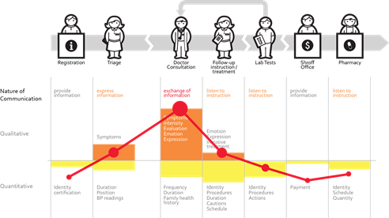

# Een customer journey uitstippelen

## Onderzoeksmethode

**Categorie**: Stepping stones  
**Naam**: Customer Journey

Het testplan is opzich duidelijk maar de customer journey, met bijbehorende touch points, zou het plan nog een stuk verduidelijken. Daarnaast geeft dit een richtlijn voor de conclusie / resultaten uit de uiteindelijk test.

## Hypothese

Ik vermoed dat het in kaart brengen van de "Customner journey" ertoe zal leiden dat het testplan verduidelijkt wordt en dat het een uitgangspunt zal geven voor de conclusie / resultaten uit het testplan.

## Test opzet

Om de customer journey goed in kaart te brengen zal er eerst gekeken moeten worden hoe een customer journay map en de touch points visueel in kaart gebracht kan worden. De onderzoeksmethode beschrijft een van de benodigde dingen als:

> Creativiteit in het fabriceren van een visueel aantrekkelijke versie van de customer journey dat bij het project past.

Dit doet mij vermoeden dat er een redelijk open idee is zonder al te strenge guidelines maar een kleine uitstap om een juiste manier te vinden is goed te doen.

Na het vinden, en beoordelen, van een journey map methode ga ik deze journey map uitwerken voor het project.

## Resultaat

### Wat is een journeymap?

Een customer journeymap wordt vaak gepresenteerd als een "infographic", dat is een textuele uitleg verduidelijkt met visueel aantrekkelijke elementen.

De journeymap wordt gebruikt om duidelijkheid te scheppen in hetgeen dat de gebruiker nu echt wil. En zorgt ervoor dat bij de vervolgstappen de gedachte van de gebruiker voorap staan.

### Hoe maak je een journeymap?

Een journeymap kan je op een aantal manieren maken, je kan gaan kijken naar analytische data, anecdotische informatie of verwachting getrokken uit een case study.

Tijdens dit onderzoek, en het project, zal voornamelijk gekeken worden naar de laatste twee. Een vervolggroep kan eventueel kijken naar de analytische data welke de test oplevert.

### Enkele belangrijke tips voor een journeymap
Enkele belangrijke tips voor het maken van een journeymap:

- Maak het niet te ingewikkeld, teveel informatie zorgt voor een rommelig plaatje.
- Verdeel de infographic over verschillende "stages", deel het domein op om kleineren, maar duidelijkere, journeymaps te maken.
- Houdt er rekening mee dat een journeymap kan veranderen tijdens de ontwikkeling van het project.

Daarnaast zijn er nog enkele belangrijke termen:

- Personas: De belangrijkste mensen, de klant, de personen waar de journeymap over gaat.;
- Timeline: Een basis tijdlijn, hoelang duurt de customer experience;
- Emotion: Pieken en dalen die emoties van gebruikers in kaart brengen.;
- Touchpoints: Klant interactie, dit zijn de acties de klant uitvoert.
- Channels: plaatsen waar de interactie plaatsvindt.

### De journey map

De journeymap heb ik besloten uit te tekenen als een soort cartoon, elk vlak stelt een touchpoint of een channel voor en de frames zijn genummerd. Onder de infographic staat in tekst uitgewerkt wat iedere frame moet voorstellen en dient als leidraad voor het geheel.

## Conclusie

## Bronnen
- [All about customer journey mapping](https://www.smashingmagazine.com/2015/01/all-about-customer-journey-mapping/)
- [Customer journey mapping examples](https://conversionxl.com/blog/customer-journey-mapping-examples/)
- [How to create a customer journey map](https://uxmastery.com/how-to-create-a-customer-journey-map/)
- [how to create a journeymap](https://www.youtube.com/watch?time_continue=0&v=mSxpVRo3BLg)
