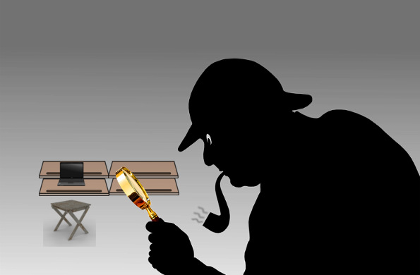
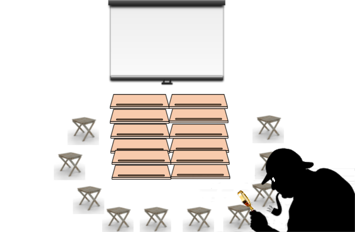

# Mockups in react

## Onderzoeksmethode

**Categorie**: Field  
**Naam**: Fly on the wall

In dit onderzoek wil ik kijken hoe het front-end design opgepakt wordt door de vertegenwoordigers van burgers zoo.
Ik ga dit doen op 30 November 2017 tijdens de demo welke gegeven wordt.

De fly on the wall methode is uitermate geschikt om gebruikersinteractie waar te nemen zonder hier zelf invloed op te hebben. Dit doe je door totaal geen interactie te hebben met degene die de test uitvoeren.

## Hypothese

Ik verwacht dat de GUI helder en duidelijk zal zijn omdat de gui erg veel lijkt op het design van Google.
Daarnaast zijn de [material design guidelines](https://material.io/guidelines/) in acht genomen bij de ontwikkeling van zowel de mockups als de echte componenten.

## Test opzet

In dit onderzoek zijn er twee test opzetten, de eerste zal gebeuren met een andere ontwikkelaar en zal dienen als test van de methode. De tweede zal betrekking hebben op de echte test welke op 30 November 2017 plaats zal vinden.

### Sketches

De onderstaande schets gaat over de testsituatie, in deze situatie is er een laptop en een testpersoon welke door de applicatie heen zal klikken.

De schaduwfiguur stelt de observant voor en zal zich onbereikbaar maken voor de testpersoon.

De tweede schets toont de echte onderzoekssituatie, hier zijn een onbekend aantal mensen bij en zal in een formelere setting plaatsvinden. Hierbij dient de schaduwpersoon wederom als observant die zich afsluit van de discussie en de onderstaande notitievorm gebruikt om te observeren. De persoon(en) die de applicatie zullen gebruiken is onbekend aangezien er meerdere vertegenwoordigers zijn en het nog de vraag is welke het voortouw wil nemen.

### Notitievorm

De notitievorm voor dit onderzoek zal flexibel maar uitbreidbaar zijn. Er zal een tabel met "acties" bijgehouden worden en van elke actie wordt geteld hoe vaak die actie voorkomt, genoteerd met een punt. Dat ziet er dan zo uit :

| Actie                 | Voorvallen |
|-----------------------|:----------:|
| Knipperen met ogen    | ...        |
| Instemmend ja knikken | .          |

## Resultaat

In dit hoofdstuk komen de resultaten van het onderzoek aan bod, aan het einde wordt hier nog een uitspraak over gedaan.

### Testopzet met @Sijmen Huizenga

| Actie                 | Voorvallen |
|-----------------------|:----------:|
|   |   |
|   |   |

## Conclusie

## bronnen
Bij dit onderzoek zijn geen concrete bronnen gebruikt.
