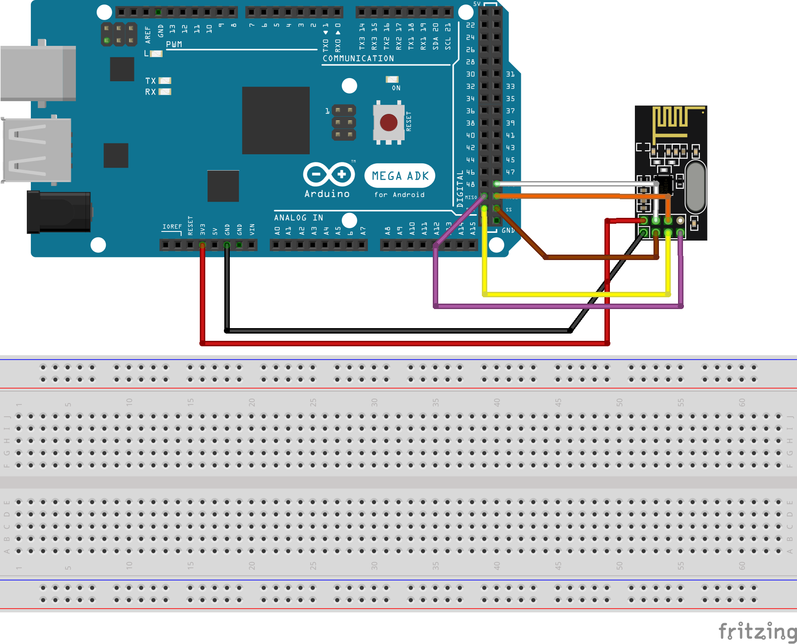
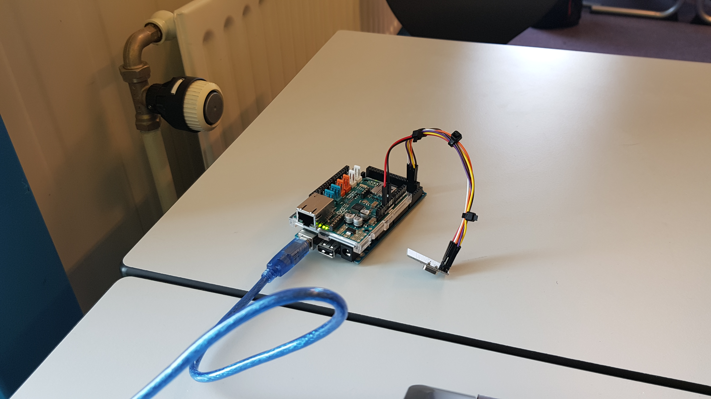
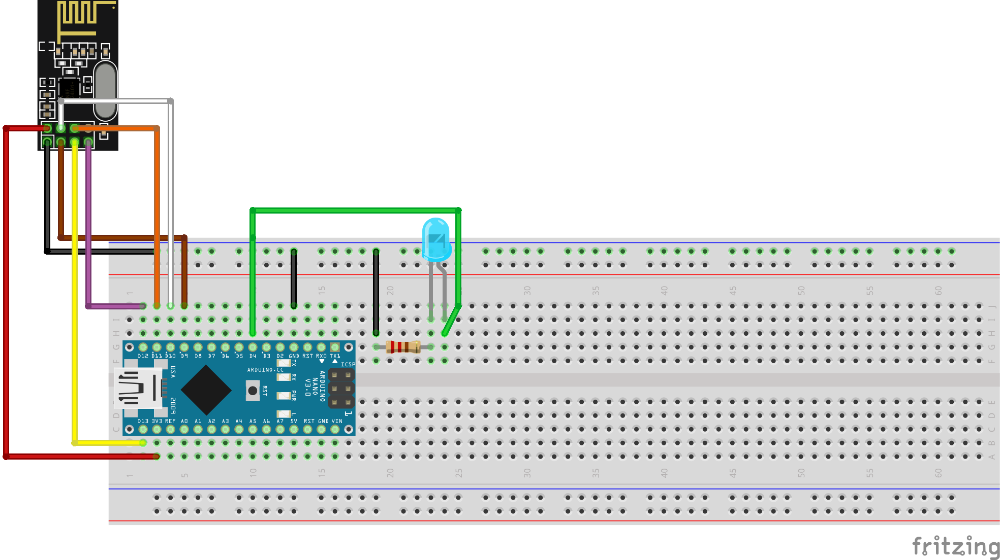

#Onderzoek naar oplossingsrichtingen gateway taal

##Onderzoeksmethode (uit de cmd methods pack)
Interview uit field in combinatie met prototyping uit stepping stones

## Hypothese:
Ik verwacht een geschikte methode te vinden waarmee we NRF kunnen uitlezen op de Raspberry Pi 3 (die we waarschijnlijk als gateway gaan gebruiken). Deze taal moet dan ondersteunen dat de infromatie uit het NRF netwerk uitgelezen kan worden.

## Testopzet:
Ik ga kijken hoe ik het makkelijkste data uit het MySensor netwerk kan uitlezen. Dit ga ik in twee talen doen om te kijken of er nog verschillen in zitten qua onderhoudbaarheid/leesbaarheid. Ik ga dit doen met Java en met Python. Binnen het IoT team heeft iedereen al ervaring met Java en tijdens de course is ook Python aan bod gekomen.
 
 Om te testen of data overkomt heb ik een node (een Arduino Nano met een NRF24L01+. Deze stuurt de hele tijd berichtjes naar de gateway. 
 
 De gateway bestaat of uit een NRF24L01+ direct aangesloten op de Raspberry Pi3 of via de seriële aangesloten op een pc (dit is te vervangen door een Raspberry Pi3).
 
 De code voor de seriële tests is te vinden in de map `code`.
 
 Aansluitschema voor de gateway:
 
*Aansluitschema seriële gateway, op een Arduino Mega ADK met EthernetShield v2 en NRF24L01+* 

 
*Seriële gateway, op een Arduino Mega ADK met EthernetShield v2 en NRF24L01+*

Aansluitschema Arduino Nano node, de LED wordt niet gebruikt:

*Aansluitschema voor de Arduino Nano met NRF24L01+*
 
## Resultaat: 

### Direct aansluiten
Ik heb als eerste geprobeerd een NRF24L01+ chip direct op een Raspberry Pi aan te sluiten. Dit gaat niet werken omdat er geen data wordt overgedragen. De chip lijkt goed aangesloten te zijn en dat heb ik ook op meerdere manieren geprobeerd. De conclusie is dan ook dat deze manier van werken met Raspberry Pi en NRF24L01+ chip geen optie is.

### Seriële poort
Met Python lijkt het uitlezen vrij simpel. Voor een minimale sketch (in de map code te vinden) is maar 26 regels code nodig. De code die al voorbeeld gebruikt is komt van dit forum: [Python seriële poort voorbeeld](https://forum.arduino.cc/index.php?topic=410574.0).

De Java code is iets uitgebreider en bied ook checks voor poorten. Ook wordt alles "netjes" gedaan en wordt zit er ook code bij om de seriële poort goed te sluiten. Ook is hier een code voorbeeld voor gebruikt, dit voorbeeld komt van de Arduino site af: [Arduino playground](https://playground.arduino.cc/Interfacing/Java).

## Conclusie
Om een beslissing te nemen voor de taal heb ik ook binnen de twee IoT groepen waar de ervaringen en voorkeuren liggen. Omdat Python een vrij onbekende taal voor ons is en we de focus niet op de gateway willen leggen hebben we gekozen voor Java. Deze taal kennen we allemaal en kunnen we dus vrij snel een gateway in opzetten. Ook is de code om de seriële poort uit te lezen helder en is de conclusie dat we hier mee aan de slag kunnen.