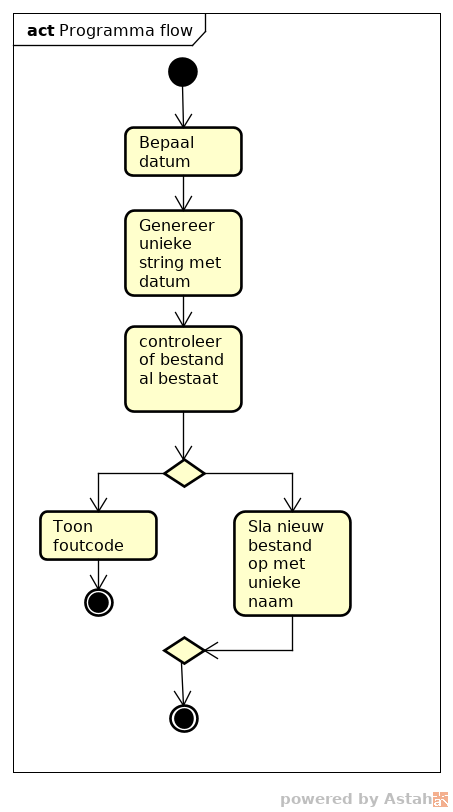

# Unieke filenames

## Onderzoeksmethode

**Categorie**: Workshops <br />
**Naam**: Proof of concept

In dit onderzoek wil ik onderzoeken of we een cryptografische library kunnen gebruiken om unieke filenames te genereren. Dit wil ik doen omdat er bestanden geupload moeten worden met de web interface. Deze bestanden zullen opgeslagen moeten worden onder een unieke naam zodat ze gemakkelijk gekoppeld kunnen worden aan een poot.

## Hypothese

De verwachting is dat NodeJS's crpyto library middels de randomBytes- of pseudoRandomBytesmethode unieke bestandsnamen kan genereren.

## Test opzet

Om te bewijzen dat een cryptografische library gebruikt kan worden om unieke filenames te genereren is er een programma geschreven (in nodeJS) dat z.s.m 1 miljoen bestanden met een unieke naam genereerd.

De programma flow is als volgt:



Uit de [bron](https://stackoverflow.com/questions/18130254/randombytes-vs-pseudorandombytes) blijkt verder nog dat randomBytes en pseudoRandombytes hetzelfde onderliggende algorithme gebruiken en dus uitwisselbaar zijn. Het programma maakt gebruik van pseudoRandomBytes.

### Belangrijke instellingen

De volgende instellingen / code wordt gebruikt om de bestandsnamen te genereren:

``` js
var crypto = require('crypto'),
  algorithm = 'aes-256-ctr',
  password = 'd6F3Efeq';

crypto.pseudoRandomBytes(16, function (err, raw) {
    cb(null, raw.toString('hex') + Date.now() + '.' + mime.extension(file.mimetype));
});
```

De rest van de programma code zit in het [app.js](app.js) bestand.

## Resultaat
Het resultaat liet even op zich wachten maar na de test 3x uit te voeren is er nog geen enkel bestand aangemaakt met een naam die al bestond.

Uit dit onderzoek blijkt dus dat de crypto library van nodeJS prima geschikt is om unieke bestandsnamen mee te genereren.

## bronnen
1. [randombytes vs pseudorandom](https://stackoverflow.com/questions/18130254/randombytes-vs-pseudorandombytes)
2. [nodejs randomBytes](https://nodejs.org/api/crypto.html#crypto_crypto_randombytes_size_callback)
