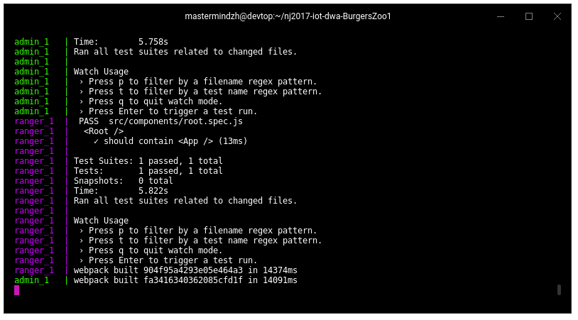
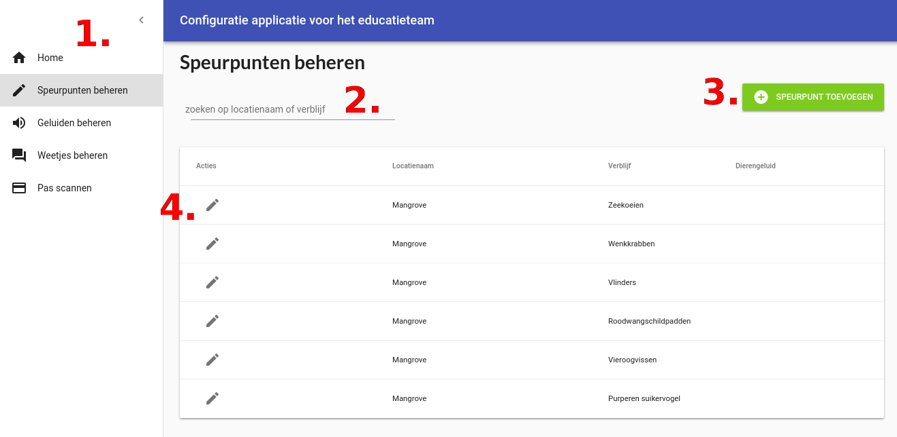
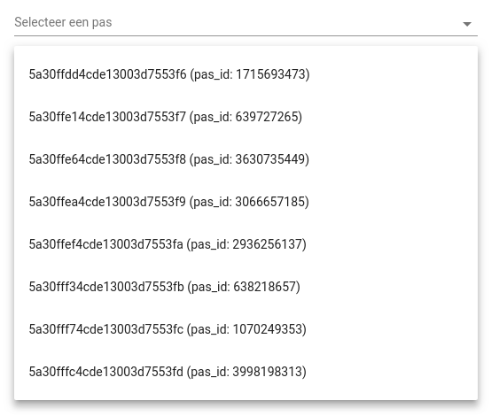
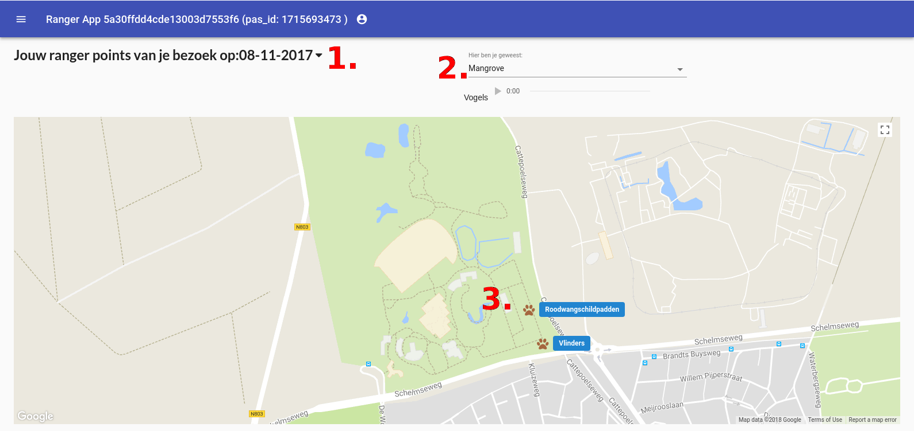
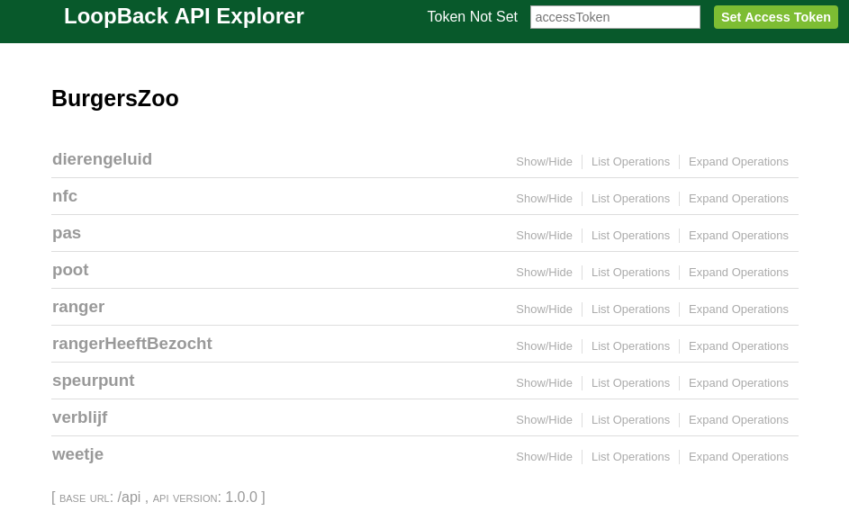
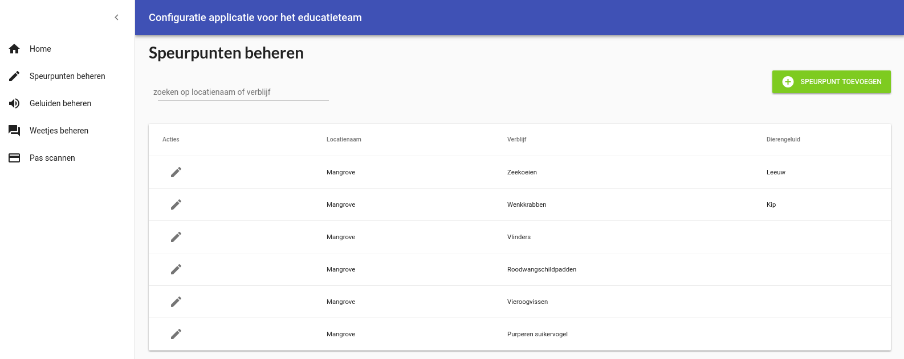
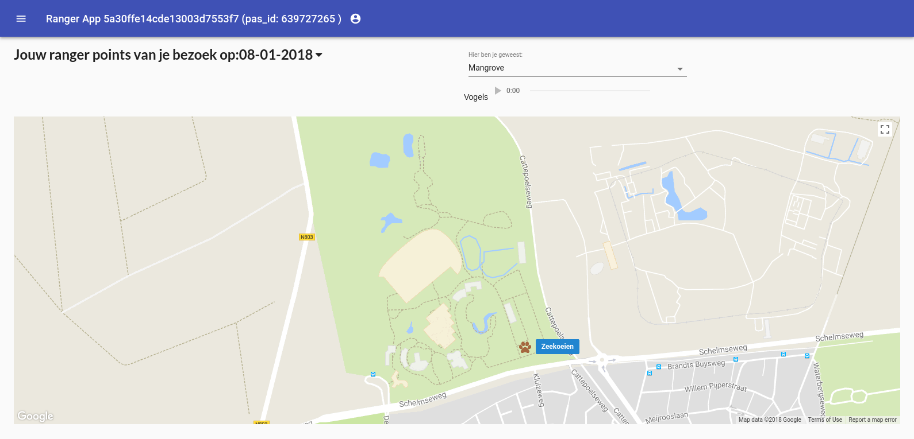

### Starten Backend + Web Apps
Dit hoofdstuk zal beschrijven hoe alle webapplicaties, de backend en de database opgestart moeten worden. Ook zal dit hoofdstuk beschrijven hoe de database gevuld kan worden met het seedscript zodat er wat testdata in de apps staat.

#### Randvoorwaarden

Om alle applicaties te draaien moeten er een aantal dingen geregeld worden op de pc/laptop.
De tabel hieronder geeft aan welke stukken software benodigd zijn en zal, waar mogelijk, een link worden geven naar de officiele website.

- [Mongo - v3.4.9](https://www.mongodb.com/)
- [Docker - version 17.11.0-ce, build 1caf76ce6b](https://www.docker.com/)
- [Docker-compose - version 1.17.1, build 6d101fb](https://docs.docker.com/compose/)
- [Node - version 9.3.0](https://nodejs.org/)
- [Npm - version 5.6.0](https://www.npmjs.com/)

Als alle bovenstaande software geinstalleerd is dan kunnen alle apps gestart worden, om de database te vullen is er echter nog een extra stukje software nodig. De software heet `mongorestore` en komt , ten tijde van schrijven, mee geinstalleerd met het mongo pakket (Op Windows met [mongotools](https://github.com/mongodb/mongo-tools)). Bekijk [deze website](https://docs.mongodb.com/manual/reference/program/mongorestore/) voor meer informatie. Ook zullen de mensen met Windows 10 home de [docker-toolbox](https://docs.docker.com/toolbox/toolbox_install_windows/) moeten installeren omdat zei geen hyper-v beschikbaar hebben.

#### Het starten van de web applicaties en de database

Het volgende hoofdstuk zal uitleggen hoe de applicaties gestart kunnen worden in zowel development modus als productie modus. Voor het testen is alleen de development modus meer als genoeg.

> ***NOTE!  de commando's zijn bedacht voor Linux en Mac OS X, hieronder wordt beschreven hoe het werkt voor alle drie de systemen al is het ten zeerste aan te raden om een Linux Virtual machine op te zetten. (klik [hier](https://www.storagecraft.com/blog/the-dead-simple-guide-to-installing-a-linux-virtual-machine-on-windows/) voor uitleg)***

##### Mac OS X & Linux, file watchers verhogen.

Op Linux en Mac OS X zit een limiet op het aantal bestanden / mappen waar een gebruiker tegelijk naar mag "luisteren" voor veranderingen. Webpack in development modus houdt namelijk bij welke bestanden je aanpast om snel te kunnen herladen. ([hot module reloading](https://webpack.js.org/concepts/hot-module-replacement/))
Als Docker goed geinstalleerd is op Mac OS X hoeft er niets gedaan te worden, is dat niet zo (of wordt er Linux gebruikt) moet je het volgende commando uitvoeren:

```
echo fs.inotify.max_user_watches=524288 | sudo tee -a /etc/sysctl.conf && sudo sysctl -p
```

Voor technische info klik [hier](https://github.com/emcrisostomo/fswatch), voor sysctl uitleg [klik hier](https://wiki.archlinux.org/index.php/sysctl).
##### Installeren van de dependencies
Om de benodigde NPM software te installeren moet het volgende commando gedraaid worden:

```js
npm install
```

Dit zal tegelijkertijd de docker containers die nodig zijn voor het draaien van de software aanmaken.
Om te controleren of het installeren goed is gegaan kan je in de opdrachtprompt zien hoe lang het geduurd heeft.

Dit ziet er als volgt uit:

```
xxx packages installed succesfully in x.xxs
```

##### Development applicaties

Om de applicaties in development modus te starten (in Docker) moet het volgende commando worden uitgevoerd:

```cmd
npm start
```

Als Windows wordt gebruikt moeten eerst de [extra stappen voor windows uitgevoerd worden](#extrawindowsstappen).

Als deze zijn opgestart, iets dat de eerste keer lang kan duren, zie je ongeveer het volgende:



##### De database vullen met voorbeelddata
Om snel aan de slag te kunnen met het front-end wordt een script geboden dat de database vult met testdata. Om dit script uit te voeren moet het volgende commando getypt worden in een bash shell ([windows instructies](https://www.howtogeek.com/249966/how-to-install-and-use-the-linux-bash-shell-on-windows-10/)):

```cmd
bash seedscript.sh -h localhost:8009
```

##### De applicaties gebruiken



De admin applicatie heeft een aantal schermen welke allemaal hetzelfde principe hanteren. Op de foto hierboven staat het "speurpunten beheren" scherm met een aantal nummers afgebeeld, hieronder volgt een lijst met een uitleg wat de nummers doen.

1. Via het menu kunnen de verschillende pagina's bereikt worden
2. Op de meeste pagina's zit op deze plek een zoekveld welke gebruikt kan worden om te zoeken in de lijst van resultaten.
3. Op plek nummer 3 zit een knop om iets toe te voegen aan de lijst
4. De lijst met resultaten, in de eerste kolom staat nog een potloodje waarmee die specifieke rij aangepast kan worden.

Op de volgende foto is de ranger applicatie te zien, ook deze is genummerd en onder de foto staat de uitleg.

Voor je de app in kunt moet je even inloggen met 1 van de passen:


Daarna zie je het volgende scherm (zonder nummers)


1. Boven in de applicatie selecteer je de datum van het gewenste bezoek.
2. Bij het selectiemenu in de rechterhoek kan je een verblijf selecteren om de kaart een update te geven met de juiste pootjes.
3. De kaart met een aantal bezochte pootjes.

Als laatste kan je de API nog exploreren op een van de volgende urls:

- [http://localhost:8001/explorer](http://localhost:8001/explorer)
- [http://localhost:8008](http://localhost:8008)

<a name="extrawindowsstappen"></a>

##### Extra stappen voor Windows gebruikers.

`npm start` zal, onder water, het volgende draaien:

```cmd
./node_modules/.bin/concurrently 'npm run copy-endpoint-dev && docker-compose down && docker-compose up' 'npm run docs'
```

Het commando "copy-endpoint-dev" gaat echter **fout** op een Windows systeem omdat Windows geen fatsoenlijke copy tool op de command line heeft. Als het toch op windows moet draaien moet je de kopieerstap even zelf uitvoeren. De stappen zijn dan als volgt:

1. Kopieer het bestand `./config/dev.json` naar de volgende twee locaties:

    - *./apps/admin/src/constants/external-variables/endpoints.json*
    - *./apps/ranger/src/constants/external-variables/endpoints.json*

2. Draai het `docker-compose down` commando
3. Draai het `docker-compose up` commando

##### productie builds (minified)

Om de applicaties in productie modus te starten (in Docker) moet het volgende commando worden uitgevoerd:

```cmd
npm run build
```

Dit zal, onder water, het volgende draaien:

```cmd
npm run copy-endpoint-prod && docker-compose -f ./dockerfiles/prod/docker-compose.yml down && docker-compose -f ./dockerfiles/prod/docker-compose.yml up && bash seedscript.sh -h servers.rickvanlieshout.com:8019
```

Vervang hier de server (`servers.rickvanlieshout.com:8019`) met de juiste productie server en verander ook de variabelen in `./config/prod.json` naar de benodige productie variabelen.

Het commando "copy-endpoint-dev" gaat echter **fout** op een Windows systeem omdat Windows geen fatsoenlijke copy tool op de command line heeft. Als het toch op windows moet draaien moet je de kopieerstap even zelf uitvoeren. De stappen zijn dan als volgt:

1. Kopieer het bestand `./config/prod.json` naar de volgende twee locaties:

    - *./apps/admin/src/constants/external-variables/endpoints.json*
    - *./apps/ranger/src/constants/external-variables/endpoints.json*

2. Draai het `docker-compose down` commando
3. Draai het `docker-compose up` commando
4. Draai het `bash seedscript.sh SERVERURL` bestand. (op Windows heb je hier de [bash shell voor Windows](https://www.howtogeek.com/249966/how-to-install-and-use-the-linux-bash-shell-on-windows-10/) voor nodig.)

##### De applicaties bezoeken

Om de applicaties te bezoeken, en ze te gebruiken, ga je naar de volgende web adressen:

| Applicatie                  | Adres in develop modus                        | Adres in productie modus                      | Wat te verwachten                   |
|-----------------------------|-----------------------------------------------|-----------------------------------------------|-------------------------------------|
| Back-end api                | http://localhost:8001                         | http://localhost:8011                         | Toont een starttijd en een uptime.  |
| Back-end api explorer       | http://localhost:8001/explorer                | http://localhost:8011/explorer                |         |
| Admin / educatie applicatie | http://localhost:8002                         | http://localhost:8012                         |       |
| Ranger applicatie           | http://localhost:8003                         | http://localhost:8013                         |     |
| De database                 | http://localhost:8009  mongo://localhost:8009 | http://localhost:8009  mongo://localhost:8009 |                                     |

Op dit moment draait alles van de web kant, benieuwd hoe je verder kunt? Klik [hier](#ontwikkelhandleiding) om naar de ontwikkelhandleiding te gaan.
