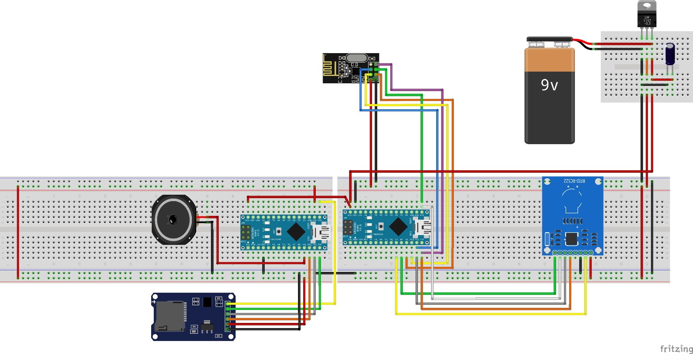

De poot is het punt waar kinderen hun passen kunnen gaan scannen. Door ontbreken van bestaande netwerk infrastructuur hebben wij de keuze gemaakt om zelf een zelfhelend mesh netwerk op te zetten doormiddel van NRF24L01+ chips icm de [MySensor library](https://www.mysensors.org/). 

De passen die gescand worden hebben een NFC chip, waarbij het unike id van deze kaart dient als identificatie nummer. Dit nummer wordt daarna verzonden via het mesh netwerk naar de backend.

#### Onderdelen poot
- 2 Arduino Nano's
- NRF24L01+
- SD/Micro SD kaart lezer
- RFID lezer
- Speaker via 3.5 mm jack
- Vorm van voeding (voor het prototype)
- Capacitor
- Voltage Regulator

Er is gekozen voor twee verschillende Arduino Nano's omdat er anders problemen onstaan met het afspelen van audio en ontvangen/versturen van data via de NRF24L01+. Deze twee chips maken allebei gebruik van de SPI bus en kunnen dus niet tegelijkertijd worden aangesproken. Om dit op te lossen zijn de Arduino's in een master/slave opstelling. Er is dan één Arduino verantwoordelijk voor de aansturing, ontvangen/versturen van berichten en uitlezen van RFID lezer. De andere Arduino Nano is verantwoordelijk voor het uitlezen van de SD/Micro SD kaart en het ontvangen van commando's van de master.

#### Aansluitschema
Deze communiceren met elkaar via I2C. Er is gekozen voor I2 en niet voor bijvoorbeeld de seriële poort omdat we tijdens het prototypen nog gemakkelijk de Arduino's kunnen debuggen.
