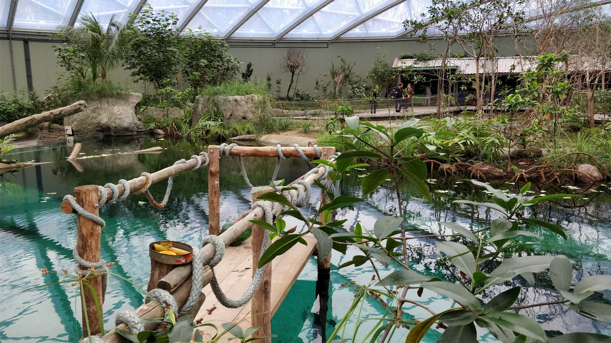
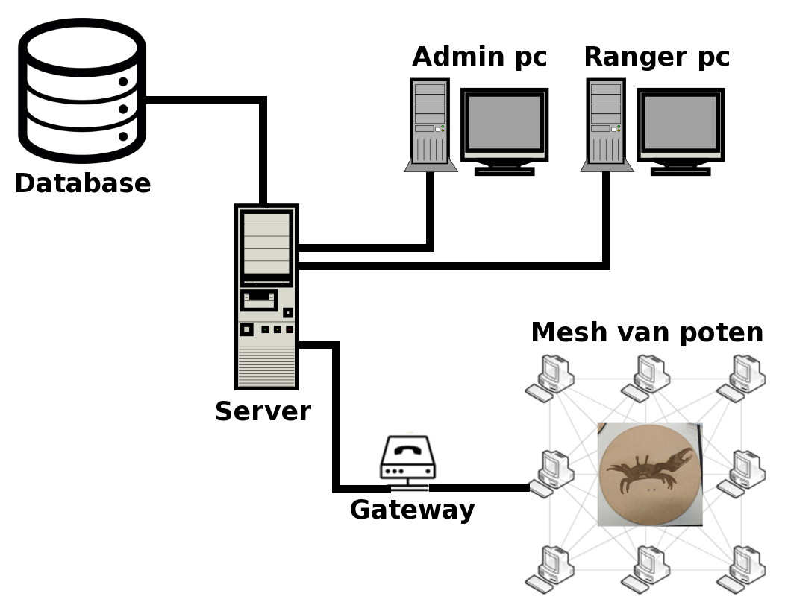
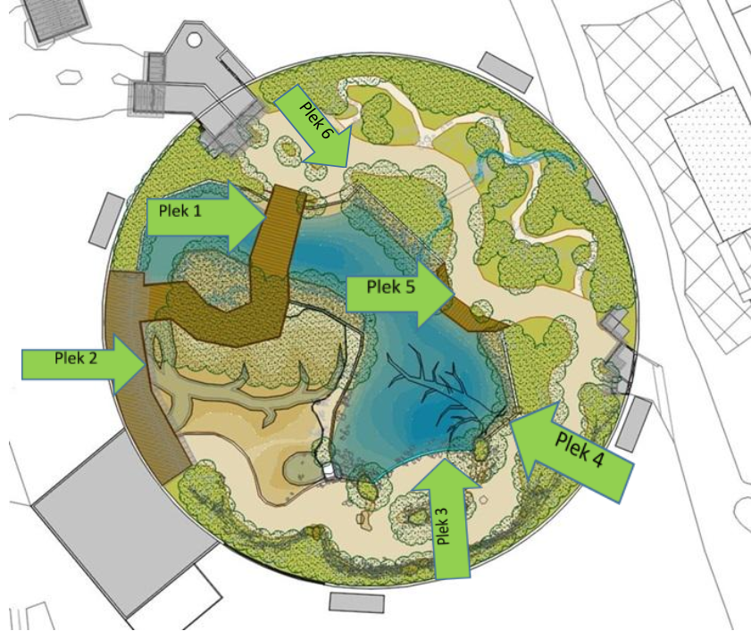
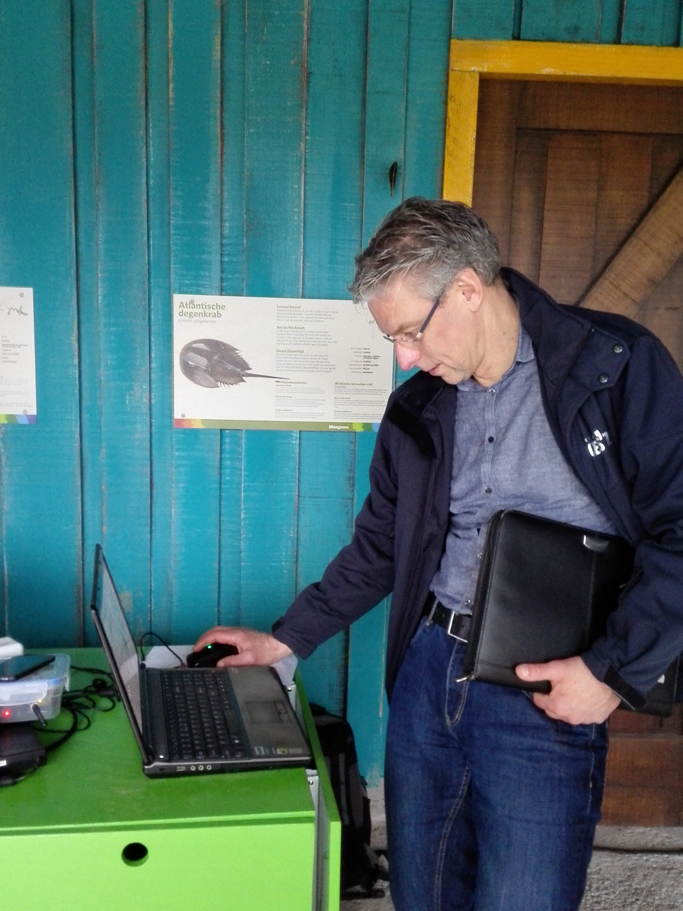
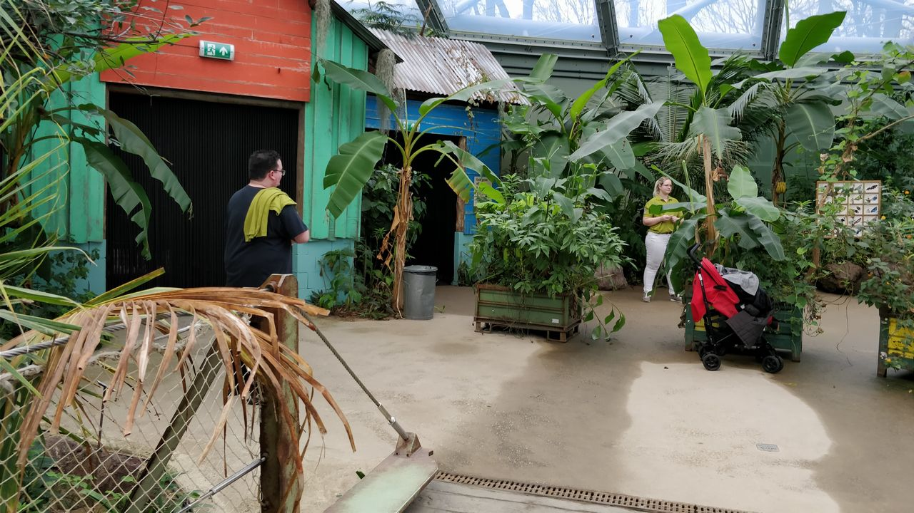
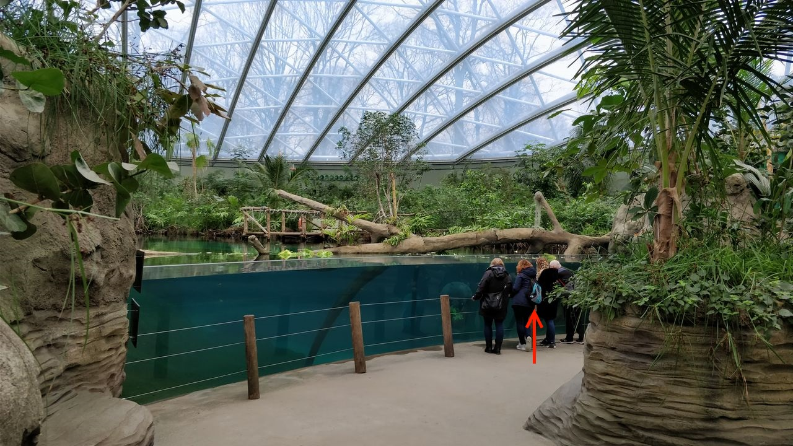
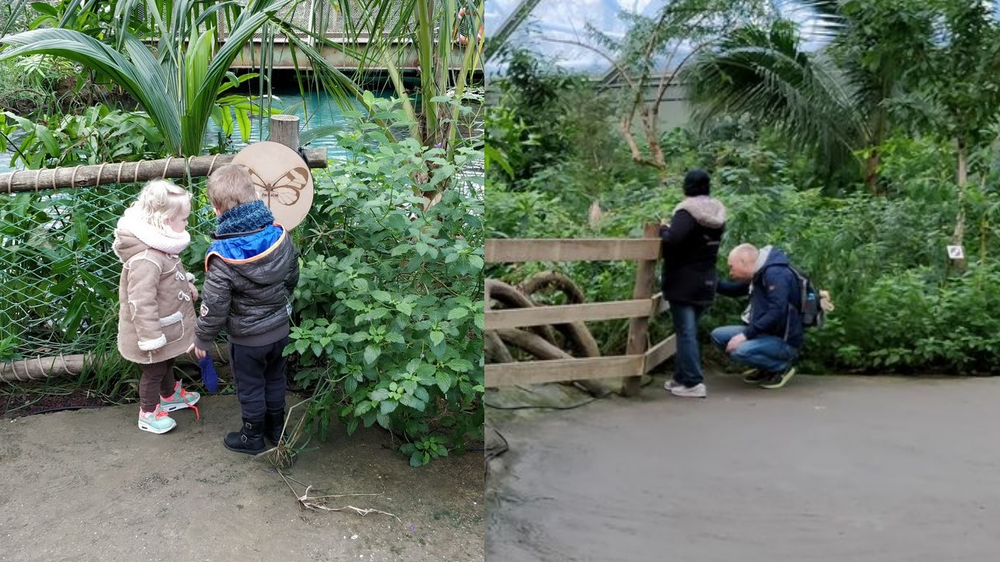
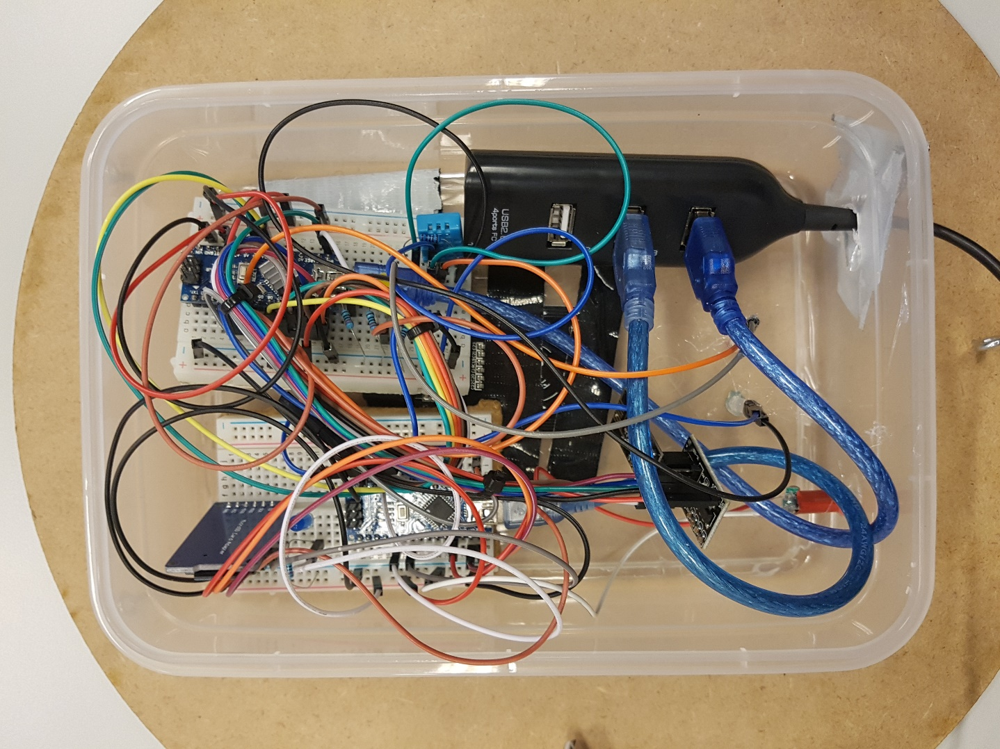
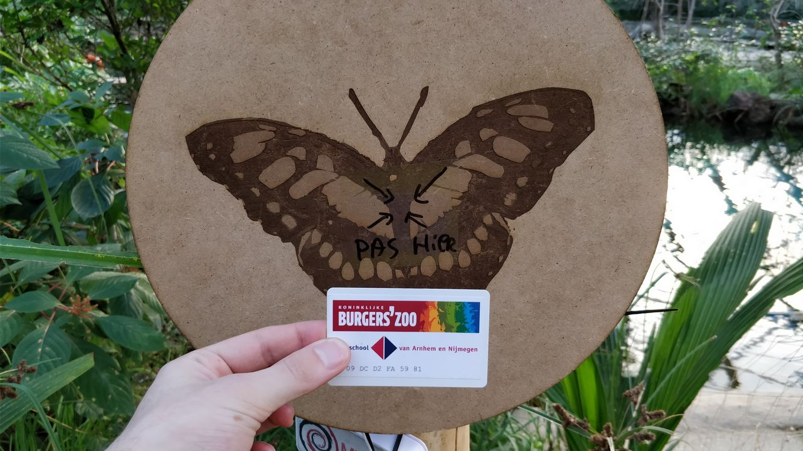

# Testrapport

## Inleiding
In november 2017 kreeg een groep ict-studenten van de Hogeschool Arnhem en Nijmegen de opdracht om een speurtochtsysteem voor Burgers’ Zoo als technisch concept uit te werken. Dit speurtochtsysteem is bedoeld voor kinderen die de dierentuin bezoeken. Het concept is dat kinderen als échte ranger door het park gaan op zoek naar pootafdrukken. Wanneer een kind een pootafdruk heeft gevonden kan deze een rangerpasje tegen de pootafdruk aanhouden om een weetje over dat dier te horen.

Het probleem waar Burgers' Zoo mee kampt is de slechte mobiliteit in het heuvelachtige park. Oudere begeleiders kunnen hun kinderen niet bijbenen, dus het even stil staan bij een pootafdruk en het beluisteren van een weetje draagt volgens Burgers' Zoo bij aan het oplossen van dit probleem. Een leuk concept, maar hoe is dit technisch haalbaar? Er is geen WIFI in het park, dus hoe vormen deze pootafdrukken samen een netwerk en hoe worden scanacties en weetjes opgeslagen zodat ze later terug te vinden zijn in een webapplicatie? Dit zijn de belangrijke vraagstukken waarop dit project gefocust is. 

Dit rapport is de uitwerking van het [testplan](./documentatie/testplan/testplan.md) dat opgesteld is vòòr de field-trial. Er wordt antwoord geven op de vraag: Werkt het prototype dat dit project gebouwd is door de projectgroep in Burgers’ Zoo écht? Het volledige prototype is binnen de Mangrove uitgerold en echte bezoekers hebben met het systeem gewerkt. Daarnaast is getest met de opdrachtgever om te zien of de Admin webapplicatie te begrijpen is en naar behoren werkt.

Verder beschrijft het rapport een technische context van opdracht, een doel, een hypothese en een aanpak van de test. Afsluitend worden de resultaten van de test getoond met een korte conclusie.

*Impressie van de Mangrove waar de tests zullen plaatsvinden*

## Inhoudsopgave
<!-- toc -->

## Technische context
Het speurtochtsysteem bestaat uit een meshnetwerk van zes apparaten die elk een onderdeel van de speurtocht vertegenwoordigen. Een ranger kan zo'n apparaat, ook wel een 'poot', 'speurpunt' of 'scanpunt' genoemd, scannen met een verkregen rangerpas. Deze pas maakt gebruik van NFC technologie. Alle scan-acties van een ranger worden online in de cloud opgeslagen. Deze cloud is ook onderdeel van het systeem.
Educatoren van Burgers’ Zoo kunnen online de speurpunten beheren, dit houdt kortgezegd in dat ze voor de speurpunten een aantal gegevens (naam, verblijf, dierengeluid, etc.) in kunnen voeren en weetjes aan een speurpunt toe kunnen voegen. Zo kan de inhoud en vormgeving van de speurtocht aangepast worden.
Wanneer een ranger het park verlaten heeft, kan hij achteraf via de ranger webapplicatie de geschiedenis van al zijn parkbezoeken terug zien. Zo kan hij zien welke speurpunten hij allemaal wel en niet gevonden heeft in het park.

  
*Schematisch architectuurschets.*

## Begrippenlijst
| Begrip                | Uitleg                                                                                                                                                          |
|-----------------------|-----------------------------------------------------------------------------------------------------------------------------------------------------------------|
| De educatiemedewerker | Een medewerker van Burgers Zoo die de verantwoording draagt voor de kennisoverdracht naar de bezoekers en/of kinderen.                                            |
| De technische dienst  | Medewerkers van de Burgers zoo welke gaan over technische zaken in het park. Dit kan gaan over het aanleggen van een stroompunt tot het vervangen van een lamp. |
| Poot                  | Onder “Poot” wordt het apparaat verstaan dat gebruikt wordt om progressie te registreren. Dit is dus het voorwerp waar een bezoeker de pas scant.               |
| Field Trial           | CMD methode kaart FIELD                                                                                                                                         |
| Speurpunt             | Een volledig geconfigureerde poot welke in een speurtocht staat.                                                                                                |
## Doel
Het doel van de test is om de techniek van het systeem te testen: werkt het? We willen testen dat wat er in de webapplicatie geconfigureerd is, gereflecteerd wordt in de hardware en andersom: als er een pas gescand wordt bij het scanpunt, is dat terug te zien in de webapplicatie. De test wordt uitgevoerd in de Mangrove leefwereld van Burgers' Zoo.

### Hypothese
Door middel van het bevestigen of ontkrachten van de hypothese wordt antwoord gegeven op de vraag of onze gekozen oplossingsrichting in praktijk goed werkt:
> Wij geloven dat een meshnetwerk van zes poten in de Mangrove, gebruikmakend van NRF-communicatie zal resulteren in een stabiel speurtocht-ranger-systeem dat verbonden staat met de cloud. We weten dat we succesvol zijn als een speurtocht via de webapplicatie geconfigureerd wordt, en de door ranger gescande resultaten van diezelfde speurtocht terug kunnen zien, in een web applicatie die de data uit de verbonden cloud toont.

## Out of scope
Het doel van deze test is niet om het concept van een speurtocht te testen. Dit is namelijk door een vorige projectgroep gedaan. Het testen of de speurtocht aanslaat bij kinderen valt buiten de scope van deze test. Verder is het ook niet het doel om de usability van de beheerder applicatie te testen. In hoeverre het design van de applicatie aanslaat bij de educatoren en in hoeverre de educatoren zelf hun weg kunnen vinden door de applicatie valt buiten de scope van deze test.
De gebouwde ranger applicatie is niet onderdeel van het doel van de test. Zoals te lezen is in de teststrategie wordt deze ranger applicatie mogelijk wel ingezet, maar het gebruik van en de reactie op de ranger applicatie zal niet worden geanalyseerd.

## Aanpak
Op de testdag hebben we bezoekers gevraagd om mee te doen aan onze speurtocht. Deze speurtocht bestond uit zes scanpunten die bezoekers moesten scannen. Deze zes scanpunten, samen met de gateway die de informatie doorstuurt naar de backend vormt een meshnetwerk waarmee de informatie wordt doorgestuurd. Zodra de bezoekers het rondje hebben gelopen hebben is aan ze gevraagd hoe het ging en of ze nog feedback hebben.

De admin applicatie is door een medewerker van Burgers’ Zoo getest en de medewerker heeft hierop feedback gegeven. De volledige aanpak is te lezen in het [testplan](../documentatie/testplan/testplan.md). 

  
* De plekken in de mangrove waar de speurpunten geplaatst worden. *

## Resultaten
In dit hoofdstuk zijn de resultaten van de verschillende tests beschreven.

### Test admin app
inleiding  **TODO**  

  

### Techniek Test
De Techniek test is gedaan in de vorm van een speurtocht. Voor de bezoekers was het idee om mee te doen aan de speurtocht en later hun bevindingen aan een student bij de uitgang te vertellen. De IoT’ers hebben het systeem in de gaten gehouden door rond te lopen en het systeem digitaal te monitoren. Hieruit zijn aanbevelingen gekomen voor een volgende projectgroep.

Hieronder is een korte sfeerimpressie te zien van de speurtocht:
[Speurtocht video](https://www.youtube.com/watch?v=nrqekrv-Ccw)

  
*De locaties van alle poten.*

#### Bevindingen bezoekers
Bij de ingang van de Mangrove is verteld dat we de technische haalbaarheid van een speurtocht willen testen en is er uitleg gegeven over hoe de speurtocht werkt. Dus: scan je pasje bij het dier op het scanpunt en je krijgt een weetje te horen. 

Bij het inleveren van de pasjes werd er gevraagd naar de ervaring van de bezoekers. Veel bezoekers reageerden enthousiast en zeiden dat ze het een leuk idee vonden, zo’n speurtocht.

  
*Impressie van de ingang/uitgang crew.*

Echter waren er wel een paar aanmerkingen. De meest voorkomende tips en tops zijn hieronder weergegeven:  

Tops:
* De speurtocht leert de kinderen iets leuks over de dieren.
* De weetjes die je iets lieten doen, zoals het zoeken naar een schildpad, waren het leukst.
* De afbeeldingen op de scanpunten zijn mooi.
* De speurtocht zorgt er voor dat de kinderen niet super snel door de mangrove heen rennen. Het laat ze even stil staan en kijken naar de dieren en planten om zich heen.

Tips:
* Het geluid van de speakers was te zacht.
* De speurpunten waren moeilijk te vinden.
* De speurtocht heeft te weinig interactie.
* De weetjes waren te makkelijk, zoiets als “een Zeekoe zwemt hier in het water” heeft geen toegevoegde waarde.
* Niet alle speurpunten deden het (goed).
* Veel bezoekers gaven aan dat de speakers te zacht waren en dat niet alle scanpunten het goed deden. Dit begrepen ze wel omdat het een Field Trial is. Ze konden zich inleven in de speurtocht alsof er goede speakers stonden en het scannen van de pas meteen werkte.
* De lampjes aan de voorkant van het scanpunt zijn niet goed te zien. Zorg dat ze meer uitsteken en dat ze verder uit elkaar staan.
* De weetjes worden te snel uitgesproken.

Er is echter weinig feedback gegeven die gerelateerd is aan onze hypothese. Geen enkele bezoeker heeft geklaagd over het feit dat het systeem niet werkte, er waren wat mankementen maar er was niemand die geen vertrouwen had in het systeem als geheel. Dit geeft dus aan dat bezoekers het systeem technisch haalbaar vinden.

#### Bevindingen m.b.t. plaatsing scanpunten
Het kiezen van een juiste plek voor de scanpunten bleek in praktijk lastiger te zijn dan vooraf gedacht. Al tijdens het opzetten van de eerste poten bleek dat bepaalde plekken in de dierentuin altijd bezet zijn met bezoekers. Wij hadden bedacht midden voor het raam voor de zeekoeien een scanpunt te plaatsen. Maar dit lukte steeds niet...

  
*De rode pijl geeft de beoogde plek aan voor het scanpunt.*

Dus hebben we het scanpunt rechts in de hoek geplaatst waar het minder druk was. Toch bleek dit niet optimaal omdat hier maar twee mensen omheen konden staan. Zo werd het daar snel te druk…

  
*De rode pijl geeft de plek van het scanpunt aan.*

Verder bleek de hoogte lastig te zijn. De scanpunten waren tijdens de test op ooghoogte van kinderen gemonteerd, maar hierdoor moesten ouders van kleine kinderen steeds bukken om het geluidje te horen. Deze vergelijking is in onderstaande twee afbeeldingen goed te zien.

  
*Voor kinderen is de hoogte perfect, maar ouders moeten bukken.*

#### Technische bevindingen: NFC
Tijdens de test kwamen een aantal problemen met de RFID-scanners en NFC passen naar voren. 

Ten eerste bleek dat de RFID-scanners gevoelig zijn voor verstoring door andere componenten in de behuizing. Wanneer andere draadjes en componenten op een bepaalde manier te dicht bij de RFID-scanner zaten kon de RFID scanner bepaalde pasjes niet detecteren. Dit probleem trad op bij twee van de zes scanpunten.

  
*De binnenkant van een poot*

Verder werkte de nieuwe NFC passen die wij hebben gekocht werkte minder dan de NFC passen die door de HAN geleverd zijn met de scanners die wij tot onze beschikking hadden. Het uitlezen van deze nieuwe passen ging vaker fout, waardoor de uitgelezen data corrupt was. Hierdoor klopte het unieke ID niet altijd als de pas te snel van de RFID-lezer werd verwijderd. Ook toonde het scanpunt soms het groene lampje (wat een indicatie is voor een goed uitgelezen pas) maar kwam er een leeg bericht binnen bij de gateway. Deze kon dus het bericht niet omzetten van hexadecimaal getal naar een decimaal getal waardoor er af en toe een `java.lang.NumberFormatException: Zero length BigInteger` exceptie werd gegooid.

Het was voor bepaalde gebruikers niet duidelijk waar de pas te houden. Aan de voorkant zat geen markering waar de pas precies tegenaan gehouden moest worden. Hierdoor was het voor veel bezoekers zoeken naar de plek om de pas tegenaan te houden. Dit leverde problemen op en al vrij snel kregen we te horen van bezoekers dat sommige scanpunten het niet deden. Toen zijn er stickers op aangebracht waardoor het duidelijker was waar er gescand moest worden. Een andere oplossing zou zijn geweest om grotere RFID-scanners te gebruiken.

  
*Een scanpunt gewapend met sticker die aangeeft waar de pas gehouden moet worden.*

##### Technische bevindingen: Geluid
Tijdens de test hebben we gebruik gemaakt van boxjes die verzorgd werden door Burgers’ Zoo. Het geluid dat uit deze boxjes kwam was erg zacht en dit is ook door meerdere bezoekers aangegeven. Er waren regelmatig ouders die moesten bukken om de het geluid te kunnen horen. 

Ook kwam er wanneer de speaker niet gebruikt werd een constant brommend geluid uit. Dit kan als storend ervaren worden wanneer een bezoeker hier dicht bij staat, al wordt dit geluid vrij snel overstemd door de achtergrondgeluiden van o.a. overige bezoekers en dierentuin geluiden. Dit probleem deed zich niet voor wanneer de speakers werden aangesloten op een mobieltje, waardoor het lijkt op een probleem met de Audiono. De exacte oorzaak hiervan is niet gevonden.

#### Technische bevindingen: Meshnetwerk & Gateway
Het meshnetwerk heeft goed gefunctioneerd tijdens de test. De berichten kwamen binnen  op de gateway tijdens het testen. Deze berichten werden goed afgehandeld en werden naar de backend doorgestuurd. In de ochtend voor de test kwamen wat foutmeldingen naar voren door het niet goed uitlezen van de unieke code (zie paar kopjes hierboven, NFC). Deze foutmeldingen kwamen niet naar voren tijdens de test met bezoekers, waardoor het uitlezen van de unieke code op de NFC pas dus wel goed werkte. 

## Conclusie
Tijdens de Field Trial hebben we ook antwoord gekregen op onze hoofdhypothese: 
> Wij geloven dat een meshnetwerk van zes poten in de Mangrove, gebruikmakend van NRF-communicatie zal resulteren in een stabiel speurtocht-ranger-systeem dat verbonden staat met de cloud. We weten dat we succesvol zijn als een speurtocht via de webapplicatie geconfigureerd wordt, en de door ranger gescande resultaten van diezelfde speurtocht terug kunnen zien, in een web applicatie die de data uit de verbonden cloud toont.

De opdrachtgever heeft met behulp van de webapplicatie een nieuw speurpunt kunnen configureren en een Zip bestand kunnen downloaden. Dit Zip bestand had de inhoud die we verwachtten en de test kan dus als geslaagd gezien worden.

Het meshnetwerk heeft goed gefunctioneerd tijdens de test. De berichten uit het netwerk kwamen stabiel binnen tijdens de test waarbij ongeveer 10 mensen tegelijkertijd deelnamen aan de speurtocht. Ook kwamen er weinig foutmeldingen naar voren waaruit we kunnen concluderen dat het systeem stabiel functioneert met meerdere gebruikers.

## Aanbevelingen
Na aanleiding van de Field Trial is er feedback voor het vervolg van dit project. Deze feedback komt uit onze eigen bevindingen en van de bezoekers die meegedaan hebben aan de Field Trial.

### Aanbevelingen na aanleiding van feedback bezoekers
Met alle bezoekers die concrete feedback gaven is er een gesprekje gevoerd. Feedback die we als concreet beschouwden bestond dus uit meer dan  “de speurtocht is wel leuk”. Er waren een paar bezoekers die zelf veel met kinderen deden voor hun werk, hier kwam veel goede feedback uit. Dit kan samengevat worden in het volgende:

Het idee van een speurtocht is leuk voor kinderen, maar om ze echt iets te leren en te zorgen dat het bij ze blijft moet je meer doen. Laat de kinderen nadenken over wat ze gehoord of gezien hebben. Weetjes laten horen zoals “Bij wenkkrabben hebben de mannetjes links of rechts één grote schaar! Zie je ook vrouwtjes, met twee kleine scharen?” zijn een stap in de goede richting, maar er is nog meer nodig. Denk bijvoorbeeld aan een quiz voor de kinderen. Dit kan op papier of via knoppen bij de speurpunten. Zo moeten ze echt goed luisteren in plaats van pasje scannen en snel weer door rennen. Ook is het beter om een plaatje van het dier er bij te geven wanneer je kinderen vraagt om een dier te zoeken.

We hebben een pasje gebruikt als scan object. Dit is natuurlijk iets wat snel kwijt raakt. Andere oplossingen kunnen zijn een keycord met het pasje daaraan of iets wat kinderen kunnen dragen zoals een polsbandje.

Er is gepraat met de bezoekers over de Ranger app die ontwikkeld is. Hier waren gemixte reacties over. Aan de ene kant is het leuk om te kunnen zien wat je allemaal beleefd hebt in de dierentuin en wat er nog te beleven valt. Ook is dit handig voor commerciële doeleinden. Aan de andere kant is het lastig te gebruiken omdat kinderen thuis vaak alweer vergeten dat ze naar de dierentuin geweest zijn en dan iets anders gaan doen. Hier moet dus een balans in gevonden worden.

Bezoekers vonden de speurpunten soms lastig te vinden. Dit kwam omdat ze niet direct in het blikveld van de bezoekers stonden en een houten kleur hadden dat opging in de omgeving. Nu is het natuurlijk een speurtocht, dus zoeken naar een speurpunt is niet erg. Wel gaven bezoekers aan dat een opvallend kleurtje handig is, zodat het ook duidelijk is dat je een speurpunt gevonden hebt in plaats van decoratie. Felle kleuren spreken ook kinderen aan.

Tijdens de test is er een kind van zo'n 4 jaar gespot die met twee handen een van de scanpuntte vastpakte en het punt als een stuur begon rond te draaien. Het scanpunt zelf kwam niet los, maar de speaker die niet stevig was bevestigd viel wel naar beneden. Wanneer er weer een test wordt gedaan waarbij kinderen zijn betrokken adviseren wij om alle onderdelen stevig vast te zetten. Ook denken we dat als de poot een andere vorm zou hebben het kind minder geneigd zou zijn de poot als stuur te willen draaien. 

Als er door een volgende projectgroep opnieuw getest gaat worden in Burgers' Zoo hebben we nog wel een aantal praktische tips: 
* Kijk of het mogelijk is om allemaal herkenbare kleding te hebben. Er kwam vaak de vraag 'Hoor jij bij die speurtocht?'. Door herkenbare shirtjes kan meer duidelijkheid worden gegeven over wie wél, en wie niet bij de speurtocht hoort. Als anderen de shirtjes regelen zorg dat de juiste maten worden geregeld.
* Zorg voor betrouwbare communicatiemiddelen. Tijdens de test gebeurde het een aantal keer dat we elkaar nodig hadden, maar dat we elkaar niet konden bereiken. Met walkie talkies of met luide telefoons was het makkelijker geweest elkaar te bereiken.
* Breng tiewraps, ducktape en een lijmpistool mee. Wij hebben uiteindelijk van alle bevestigingsmiddelen dubbel zo veel gebruikt als verwacht. Dus zorg dat je extra hebt!

### Aanbevelingen technische feedback
De techniek achter NFC werkt goed, mensen zijn er bekend mee (OV-chipkaart wordt dagelijks gebruikt, steeds meer bankpassen bevatten een NFC chip). Het werkt ook redelijk vlot (het uitlezen duurt ongeveer halve seconden/seconde). Er zijn wel een aantal nadelen waarvoor een oplossing gezocht moet worden:

Het was niet goed duidelijk waar er gescand moest worden op de poot zelf. Het lees oppervlakte van de RFID-lezer is te klein en zou vergroot moeten worden óf de plek waar gescand kan worden moet duidelijk aangegeven worden aan de voorkant van het scanpunt. 

NFC passen werken niet allemaal even goed. Sommige zijn slechter uit te lezen dan andere. Blijkbaar zijn er verschillende kwaliteit passen waarbij goedkopere passen niet goed herkend worden door bepaalde scanners. We adviseren een volgende groep onderzoek te doen naar de verschillen in passen en een weloverwogen keuze te maken in aankoop van passen.

Het mesh netwerk werkte tijdens de test in de Mangrove prima. Het bereik en de snelheid van de binnenkomende berichten lag binnen onze verwachtingen en is een goede manier om sensor/pas data over te brengen wanneer er geen wifi netwerk beschikbaar is. 

## BIJLAGEN

